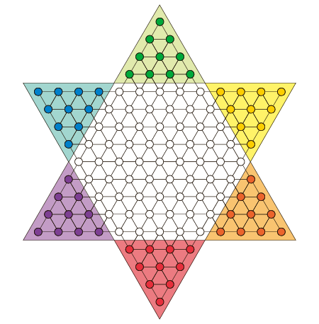

# 
 Chinese Checkers 

 CHEN Xinsheng 

 Department of Computer Science and Technology, Tsinghua University 

***

A simple implementation of the game [Chinese Checkers](https://en.wikipedia.org/wiki/Chinese_checkers) using Qt, supporting online game. Course project for *Programing and Training* in Tsinghua University, 2022.

  

Refer to the [documentation](说明文档_陈鑫圣_2021010760.pdf) for more details.

## Uasge

- Game rules:
  - Chess pieces can move to adjacent empty spaces;
  - If there are chess pieces in an adjacent position and the next position in that direction is empty, then a piece can jump to that position;
  - Surrender is only allowed after the total number of rounds reaches 20.
- How to operate:
  - Select one of your own chess pieces and click on the position in the move path one by one.
  - If it can no longer move, it will automatically fall;
  - You can also confirm the placement by clicking on the same position again while still being able to move.
- The situation of automatic judgment as failure:
  - Exceed 3 times;
  - At the end of rounds 20, 25, and 30, there are less than 5, 8, or 10 pieces left from your main camp;
  - If both parties trigger the above conditions in the same round, it will be automatically judged as a draw.
